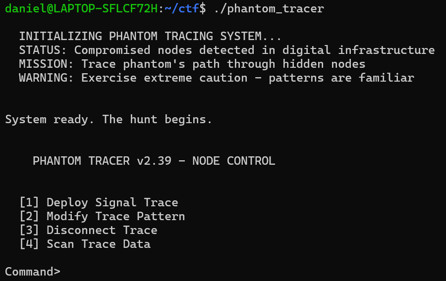
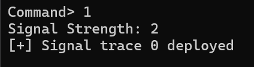
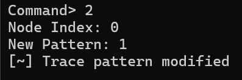
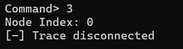
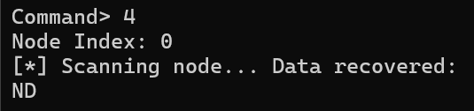

# Phantom Tracer
TISC@DEF CON SG
### Description
We deployed our Phantom Tracer system to hunt down a new threat in the digital infrastructure, but intelligence confirms our worst fears: the phantom has compromised the tracer and taken control. We need to act fast and regain control of it before the phantom disappears completely. Ironically, the security flaws we never patched when prioritising speed might be our only way back in. The hunt has become a race against time.

nc chals[.]tisc-dc26.csit-events.sg 31629

Attached files:  
libc.so  
phantom_tracer  

## Intro

I decided to do a writuep for this heap pwn challenge, hopefully it helps anyone who wants to learn pwn without blindly clanking :)

Setup:
Windows Laptop
Ubuntu WSL
Ghidra
pwndbg

## Writeup

### 1. Run the program

See how it works. 

 

 

 

 

 

4 commands, since its a heap pwn challenge, we likely know:
1 - create heap
2 - modify data at heap
3 - free heap
4 - read data at heap

There likely has to be some overflow vulnerability to leak some data.

### 2. Ghidra

Pull up the program in Ghidra

