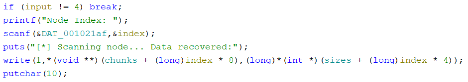
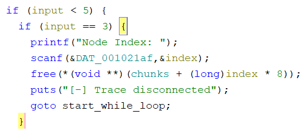
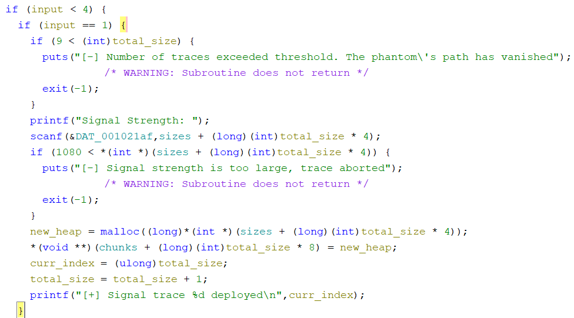
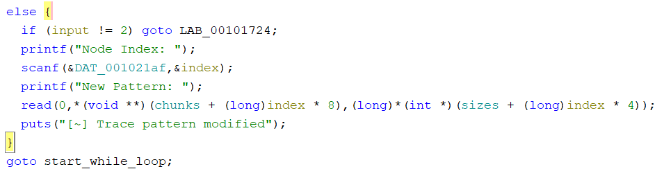

# Phantom Tracer
TISC@DEF CON SG
### Description
We deployed our Phantom Tracer system to hunt down a new threat in the digital infrastructure, but intelligence confirms our worst fears: the phantom has compromised the tracer and taken control. We need to act fast and regain control of it before the phantom disappears completely. Ironically, the security flaws we never patched when prioritising speed might be our only way back in. The hunt has become a race against time.

nc chals[.]tisc-dc26.csit-events.sg 31629

Attached files:  
libc.so  
phantom_tracer  

## Intro

I decided to do a writuep for this heap pwn challenge, hopefully it helps anyone who wants to learn pwn without blindly clanking :)

Setup:
Windows Laptop, Ubuntu WSL, Ghidra, pwndbg

## Writeup

### 1. Run the program

See how it works. 

 

 

 

 

 

4 commands, since its a heap pwn challenge, we likely know:  
1 - create heap 
2 - modify data at heap 
3 - free heap 
4 - read data at heap 

There likely has to be some overflow vulnerability to leak some data.

### 2. Ghidra

Pull up the program in Ghidra, it should open the `main()` function automatically.  
I modified some variable names: `new_heap`, `total_size`, `input`, `index`, `curr_index`.  
These can be derived from functions like `scanf`, the increments after each loop and the output text.  

input == 4, read data at heap

 

This reads the data stored in the heap at that index.  
`write(1, address of start of that node, size of that node)`
 

input == 3, free heap

 

This frees the specified node. 
Note that the data in that node is not cleared.
 

input == 1, create heap

 

There can be max 9 nodes. 
"Signal strength" refers to size of the new node, max 1080 
It then `malloc`s the size, then points the next node at this address. 
Then increments total size.
 

input == 2, modify data at heap

 

Similar to the write above 
`read(1, address of start of that node, size of that node)`

 

To put data in the node, we need to create -> modify. 
Free-ing does not clear the data. Vulnerable. 
`chunks` and `sizes` are probably a bunch of pointers, each new node is `malloc`-ed and each pointer points to the allocated memory in the heap.

